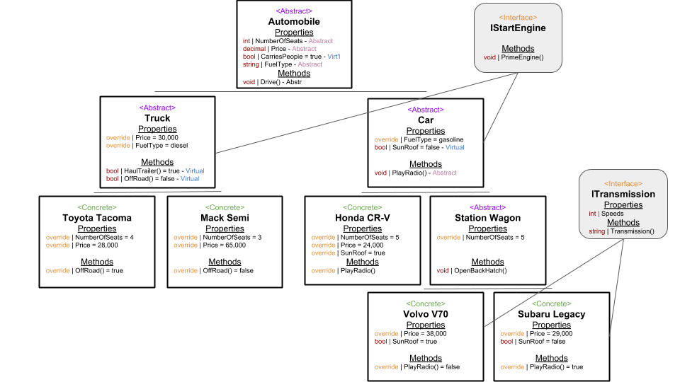
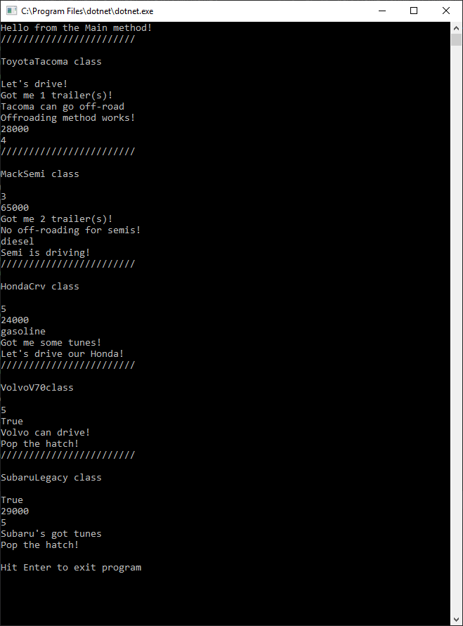

# .NET Motors Dealership
#### Lab05-dotnet-motors
##### *Author: Andrew Curtis*

------------------------------

## Description

This is a simple C# console application that runs and tests a variety of classes corresponding to basic hypothetical parts of a fictional car dealership. The project is intended to give practice in working with the OOP principles of inheritance, abstraction, polymorphism, and encapsulation. 

### Object-Oriented Programming (OOP) Principles

1. **Inheritance**: Derivative classes can inherit properties and methods (i.e. behaviors) of "parent" classes. C# does not support "multiple inheritance" (*direct* inheritance of traits from multiple parent classes simultaneously), but a class can *indirectly* inherit from multiple ancestor classes. 

    Examples of inheritance are the `Car` and `StationWagon` classes, in which inheritance is denoted by the `:` and the parent class following the class name in Car.cs and StationWagon.cs files in the .NET Motors project. 

2. **Abstraction**: Abstract classes are not themselves instantiated, and their properties and methods are initially empty and require more information before they can be instantiated by a concrete class.

    Examples of abstraction are the abstract properties in the abstract `Automobile` class in the .NET Motors project.

3. **Polymorphism**: Polymorphism allows us to change the behavior or characteristics of an abstract classes by overriding their default content upon instantiation in concrete classes. Classes and their properties and methods can be *abstract,* *virtual,* or *concrete.* 
* Abstract classes are not themselves instantiated, and their properties and methods have not initial content but only signatures. Rather, they are instantiated by derivate concrete classes that inherit from them. 
* Virtual properties and methods of abstract classes have default content assigned to them in addition to their signatures. Their content can be overridden by derivative concrete classes.
* Concrete classes instantiate abstract classes and inherit their ancestor classes' properties and methods. 

    Examples of polymorphism are the `FuelType` and `SunRoof` properties in the `Car` class in the .NET Motors project.

4. **Encapsulation**: Encapsulation groups objects' properties and behaviors together and serves to gate access to them. 

    Examples of this are the many "public" classes, properties, and methods in the .NET Motors project.

------------------------------

## Getting Started
Clone this repository to your local machine.
```
$ git clone https://github.com/amjcurtis/dot-net-motors.git
```
#### To run the program from Visual Studio:
Select ```File``` -> ```Open``` -> ```Project/Solution```

Next navigate to the location where you cloned the Repository.

Select and open ```DotNetMotors.sln```

------------------------------

## Visuals

##### Application Screenshot




------------------------------

## Change Log

1.1: *Built out classes, wrote tests and documentation* - 3/27/19
1.2 *Added further tests for interfaces, non-void methods* - 3/31/19

------------------------------
